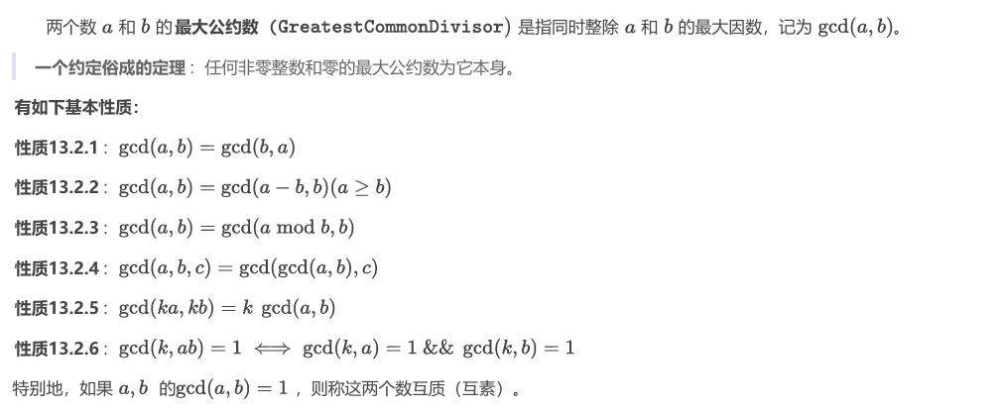

## STL二分函数
2. ```
  2. std::lower_bound
     功能：找到不小于（>=）目标值的第一个位置。
     ForwardIterator lower_bound(ForwardIterator first, ForwardIterator last, const T& value);
     ForwardIterator lower_bound(ForwardIterator first, ForwardIterator last, const T& value, Compare comp);
  
  
  3. std::upper_bound
     功能：找到大于（>）目标值的第一个位置。
     ForwardIterator upper_bound(ForwardIterator first, ForwardIterator last, const T& value);
     ForwardIterator upper_bound(ForwardIterator first, ForwardIterator last, const T& value, Compare comp);
  ```

  

### 优先队列最大堆和最小堆
```
最大堆：  std::priority_queue<int> maxHeap;
最小堆：std::priority_queue<int, std::vector<int>, std::greater<int>> minHeap;
自定义堆：
struct Task {
    int priority;
    std::string name;

    // 定义比较器，使优先级低的任务先出队（最小堆）
    bool operator>(const Task& other) const {
        return priority > other.priority;
    }

};
std::priority_queue<Task, std::vector<Task>, std::greater<Task>> taskQueue;
```


## 无序容器
```
unordered_map 
std::unordered_set
```


## 快速幂取模模板


> ```
> // 快速幂取模（迭代版本）
> long long mod_exp_iterative(long long base, long long exp, long long mod) {
>     long long result = 1;       // 初始结果为1
>     base %= mod;                // 先对底数取模，防止溢出
> 
>     while (exp > 0) {
>         // 如果当前位是1（指数为奇数），累乘当前的base
>         if (exp % 2 == 1) {
>             result = (result * base) % mod;
>         }
>     
>         // 平方底数并对模
>         base = (base * base) % mod;
>     
>         // 指数右移一位（等价于整除2）
>         exp /= 2;
>     }
>     
>     return result;
> 
> }
> 
> 
> > 费曼 求逆元
> > int inv(int x,int p) {return ksm(x, mod - 2, p) % p;}
> ```
>
> 


```
大数 快速幂：
 long long quick_mod(long long a, long long b) {
    long long ans = 1;
    while (b) {
        if (b & 1) {
            ans = (ans * a) % mod;
            b--;
        }
        b/=2;
        a = a * a % mod;
    }
    return ans;
 }
内部快速幂
long long quickmod(long long a, char *b, int len) {
    long long ans = 1;
    while (len > 0) {
        if (b[len - 1]！='0') {
            int s = b[len - 1] - '0';
            ans = ans * quick_mod(a, s) % mod;
        }
        a = quick_mod(a, 10) % mod;
        len--;
    }
    return ans;
 }

 int main() {
    char s[100050];
    int a;
    while (~scanf("%d", &a)) {     a ^ s % mod
        scanf("%s", s);
        int len = strlen(s);
        printf("%I64d\n", quickmod(a, s, len));
    }
    return 0;
 }
```


## 解绑 
    ios::sync_with_stdio(false);
    cin.tie(nullptr);
    cout.tie(nullptr);
    #define endl '\n'

## 最大公约数和最小公倍数


```
 int gcd(int a, int b){
 return b==0 ? a : gcd(b, a % b);
 }
int lcm(int a,int b){
 return a / gcd(a,b) * b;//先除后乘，以免溢出64
位整

}
```


## 逆元
```
4 线性递推求乘法逆元 
给定 n,p 求1-n  中所有的整数在模 p 意义下的乘法逆元。，输入保证 p 是质数。

 inv[1] = 1;
 for (int i = 2; i<=n; i) {
    inv[i] = (long long)(p - p / i) * inv[p % i] % p;
 }
```


 ## 二维前缀和和差分
```
二维前缀和：
  prefix[i][j] = prefix[i - 1][j] + prefix[i][j - 1]- prefix[i - 1][j - 1] + matrix[i - 1][j - 1];

    int query(int x1, int y1, int x2, int y2) {
        return prefix[x2][y2]- prefix[x1 - 1][y2]- prefix[x2][y1 - 1]+ prefix[x1 - 1][y1 - 1];
    }


二分差分：
    void update(int x1, int y1, int x2, int y2, int c) {
        diff[x1][y1] += c;
        diff[x1][y2 + 1] -= c;
        diff[x2 + 1][y1] -= c;
        diff[x2 + 1][y2 + 1] += c;
    }

从二维差分还原到原始矩阵
result[i][j] = result[i - 1][j] + result[i][j - 1]- result[i - 1][j - 1] + diff[i][j];
```

